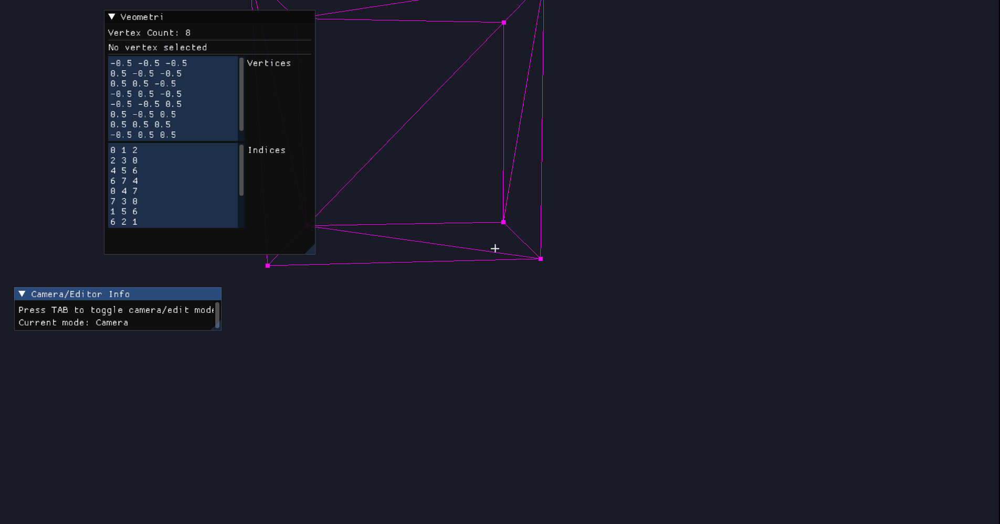

# Veometri

<p align="center">
  
</p>

A real-time visual authoring tool for indexed 3D geometry.

Veometri is a real-time visual authoring tool for indexed 3D geometry. Veometri lets users create, edit, preview, save, and load indexed 3D geometry through direct vertex and triangle-index manipulation.

## Portable geometry format

`.txt` is Veometri's default, language-neutral save/export format. It contains a flat
interleaved vertex array and a flat index array, ready to paste into many programming
languages without a JSON parser. Existing `.geo` and `.meshgeo` files remain readable.

## Capabilities

It provides OpenGL rendering, an FPS camera, vertex/triangle picking, vertex dragging, triangle deletion, editable geometry text, and New/Open/Save/Save As.

<p align="center">
  
</p>

## Platforms and prerequisites

Linux/GCC is verified locally; Ubuntu GCC, Ubuntu Clang, and Windows MSVC are covered by the ready-to-move CI template. Windows is compiled but the graphical program is not launched in CI. macOS is unverified. Requirements are CMake 3.20+, Git, a C++20 compiler, OpenGL, and GLFW's platform development libraries. CMake downloads dependencies, so first configuration and clean-copy verification may require network access.

## Build and test

```bash
cmake -S . -B build -DBUILD_TESTING=ON
cmake --build build
ctest --test-dir build --output-on-failure
```

Use `-DVEOMETRI_BUILD_APP=OFF` for graphics-independent core/I/O work, `-DVEOMETRI_WARNINGS_AS_ERRORS=ON` for strict first-party warnings, or `-DVEOMETRI_ENABLE_SANITIZERS=ON` for AddressSanitizer and UndefinedBehaviorSanitizer with supported non-Windows GCC/Clang toolchains. Presets `dev`, `release`, `ci-gcc`, `ci-clang`, and `ci-msvc` are provided.

Run `./build/veometri` (multi-config builds may use `build/Debug/veometri.exe`). Shaders are copied to `assets` beside the build-tree executable. Runtime lookup tries executable-adjacent assets, then `<prefix>/share/veometri`, then a development-only source fallback, and reports every attempted path.

## Install and package

```bash
cmake -S . -B build-release -DCMAKE_BUILD_TYPE=Release -DBUILD_TESTING=OFF
cmake --build build-release
cmake --install build-release --prefix install-root
(cd build-release && cpack)
```

Installation places the executable in `bin`, shaders in `share/veometri/shaders`, and documentation/notices in the platform CMake documentation directory. CPack produces TGZ and ZIP archives.

## Controls

`Tab` toggles camera/edit mode. Mouse look and `W/S/A/D/Q/E` move the camera. Left click selects or drags a vertex; `Delete` removes the selected triangle. Menus manage documents.

## Default `.txt` array format

The file consists of exactly two brace-delimited arrays (with no language-specific
declarations). The first has one vertex per line and a stride of 8 floats in
`position3, normal3, texCoord2` order. The second contains zero-based,
`uint32`-compatible indices, with one triangle per line. For example:

```cpp
{
 // positions          // normals           // texcoords
    0.0f, 0.5f, 0.0f, 0.0f, 0.0f, 1.0f, 0.5f, 1.0f,
    -0.5f, -0.5f, 0.0f, 0.0f, 0.0f, 1.0f, 0.0f, 0.0f,
    0.5f, -0.5f, 0.0f, 0.0f, 0.0f, 1.0f, 1.0f, 0.0f
};

{
    0, 1, 2
};
```

Because the sculpt editor authors positions and topology, export generates area-weighted smooth normals. Degenerate or unused vertices receive the deterministic `(0, 1, 0)` fallback. Hard edges require duplicated indexed vertices. UVs are generated fallback data: positions are projected onto the two axes with greatest mesh extent and normalized to `[0, 1]`; they are not an authored unwrap. Loading into the editor currently discards decoded normals and UVs, while preserving positions, indices, and editing behavior.

`.geo` version 2 and legacy version 1 `indexed-geometry` JSON (including
`.meshgeo`) remain readable and receive the same generated normals and UVs. Saving uses
`.txt`; an extensionless service path gains `.txt`, while another extension is rejected.
After opening a legacy `.geo` or `.meshgeo`, **Save** opens **Save As** rather than
overwriting the source with text-array syntax. Once saved, the new `.txt` path becomes
the document's current path.

## Architecture and dependencies

`veometri_core` contains graphics-independent document/geometry logic; `veometri_io` adds the versioned codec and filesystem service; `veometri_platform` resolves assets; the `veometri` executable owns graphics and UI. See [architecture details](docs/ARCHITECTURE.md). Direct fetched dependencies are GLFW, GLAD, GLM, Dear ImGui, portable-file-dialogs, and nlohmann/json; see [third-party notices](THIRD_PARTY_NOTICES.md).

## Limitations, provenance, and contributing

There is no undo, autosave, alternative geometry format, or headless graphical smoke test. This standalone project was extracted from [`BurnCan/Maze3D`](https://github.com/BurnCan/Maze3D); that historical attribution is not a build dependency. No first-party redistribution license is currently declared; see [license status](LICENSE_STATUS.md). See [CONTRIBUTING.md](CONTRIBUTING.md) before submitting changes and [the migration checklist](docs/REPOSITORY_MIGRATION.md) before extraction.
